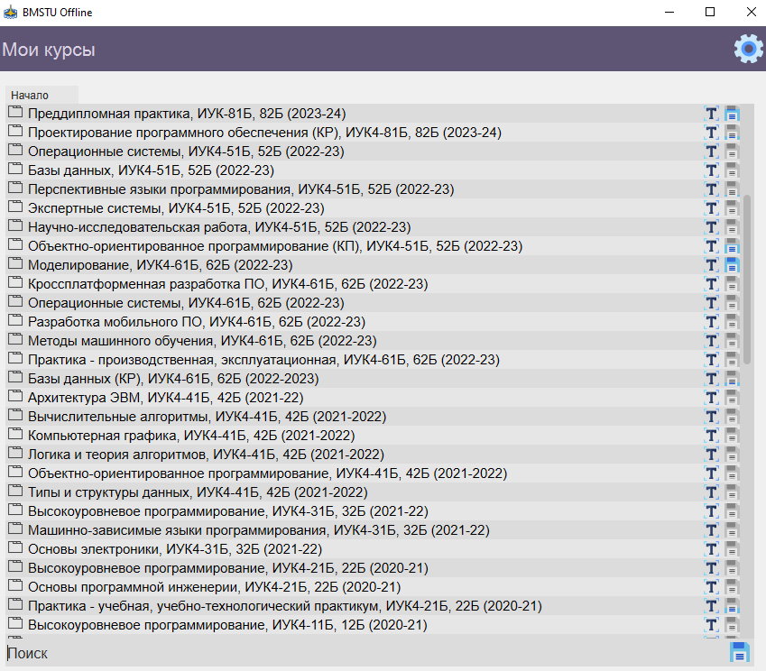
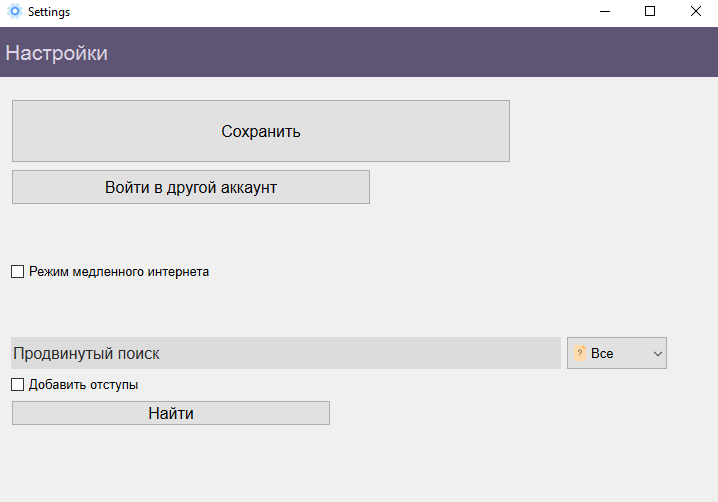
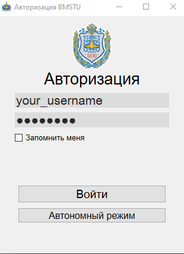

# BMSTU Offline
Парсер ЭОС КФ МГТУ Баумана, который позволяет сохранить все файлы на компьюетере для использования без доступа к интернету.

Можно использовать напрямую через Python или создать исполняемый файл с помощью PyInstaller.

Для входа требуются логин и пароль от ЭОС МГТУ им. Н. Э. Баумана.

## Демонстрация

